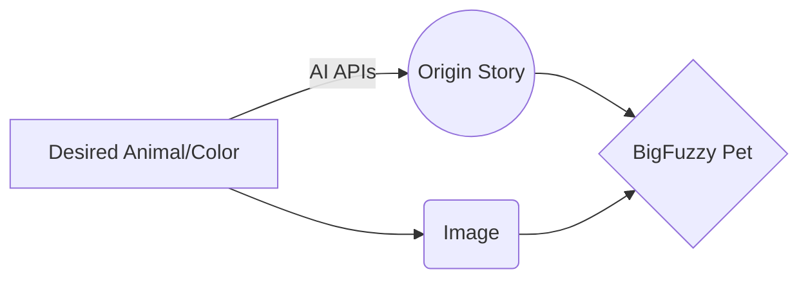

AI PET GENERATOR

## TECHNOLOGIES: 
- Next.js
- TailwindCSS
- SanityCMS
- Auth0

### Deployment pipeline: 
- Vercel

## Flow: 

```mermaid
graph LR
A[Desired Animal/Color] -- AI APIs --> B((Origin Story))
A --> C(Image)
B --> D{BigFuzzy Pet}
C --> D
```

## Images:

